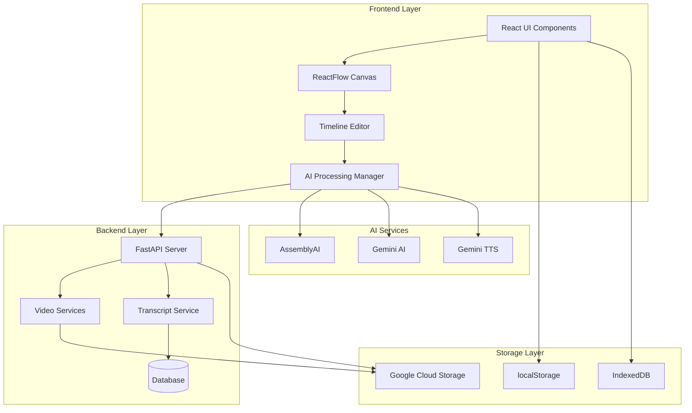
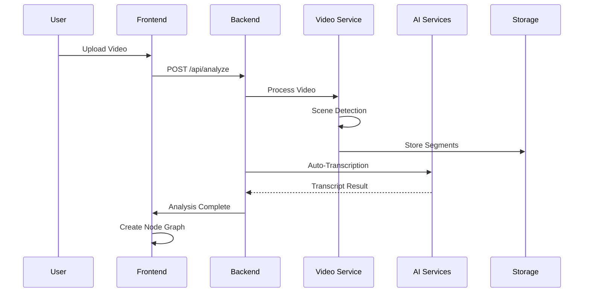
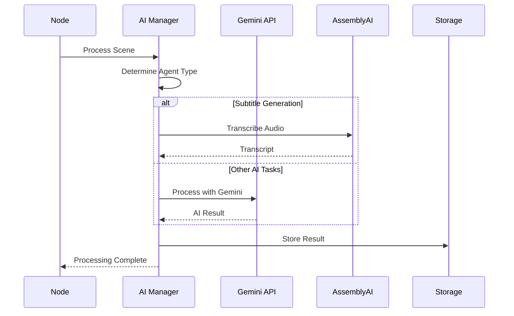
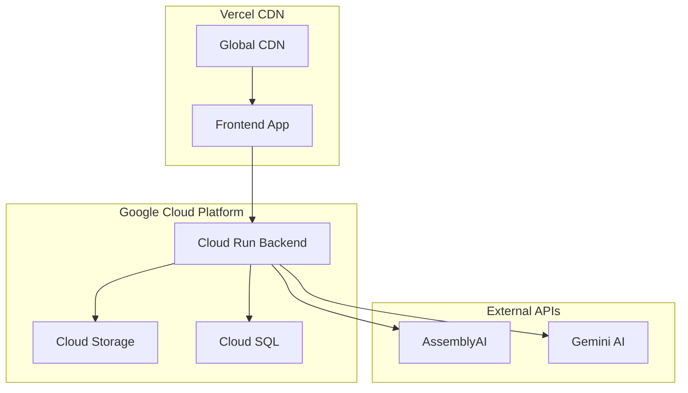

# 🏗️ Insomnia Video Editor - System Architecture

**Generated:** December 21, 2024  
**Version:** 2.0.0  
**Status:** Production Ready  

---

## 📋 **EXECUTIVE SUMMARY**

The Insomnia Video Editor is a sophisticated web-based video editing application built with a modern full-stack architecture. It combines React-based frontend with FastAPI backend, featuring AI-powered video analysis, node-based editing workflows, and cloud storage integration.

### **Key Architectural Principles**
- **Microservices-oriented**: Modular AI agents and processing services
- **Cloud-native**: Designed for scalable deployment on GCP/Vercel
- **Real-time processing**: WebSocket-based progress tracking
- **Storage-agnostic**: Multi-tier storage (localStorage, IndexedDB, Cloud)
- **API-first**: RESTful backend with comprehensive endpoint coverage

---

## 🎯 **SYSTEM OVERVIEW**



---

## 🏢 **ARCHITECTURAL LAYERS**

### **1. Presentation Layer (Frontend)**

**Technology Stack:**
- **Framework**: React 18 with TypeScript
- **Build Tool**: Vite 6.3.5
- **UI Library**: Radix UI + Tailwind CSS
- **State Management**: Zustand + React Context
- **Canvas**: ReactFlow for node-based editing
- **Timeline**: @designcombo/timeline package

**Key Components:**
```typescript
src/
├── App.tsx                 # Main application container
├── StartingPage.tsx        # Landing page
├── Sidebar.tsx            # Main sidebar with panels
├── CustomSceneNode.tsx    # Scene node component
├── components/
│   ├── AIAgentNode.tsx    # AI agent node component
│   ├── NodeTimeline.tsx   # Timeline editor modal
│   └── InteractiveSceneModal.tsx
├── features/editor/       # Timeline editor feature
└── services/             # Frontend services
```

### **2. Application Layer (Business Logic)**

**AI Processing Manager** (`src/services/aiProcessingManager.ts`):
- Orchestrates all AI agent processing
- Handles real vs mock processing fallbacks
- Manages processing progress and error handling

**Storage Orchestrator** (`src/services/storageOrchestrator.ts`):
- Intelligent storage routing (localStorage/IndexedDB/Cloud)
- Storage quota management
- Data synchronization across storage tiers

**Project Data Manager** (`src/utils/projectDataManager.ts`):
- Unified project data management
- Migration between storage formats
- Data validation and repair

### **3. Service Layer (Backend)**

**Technology Stack:**
- **Framework**: FastAPI 0.100.0+
- **Runtime**: Python 3.12
- **Database**: SQLAlchemy with SQLite/PostgreSQL
- **Video Processing**: FFmpeg, OpenCV, MoviePy
- **Cloud Storage**: Google Cloud Storage

**Core Services:**
```python
backend/
├── main.py                # FastAPI application entry
├── database.py           # Database configuration
├── models.py             # SQLAlchemy models
├── services/
│   └── transcript_service.py  # Transcript management
├── video_analysis/       # Video processing scripts
├── video_segmentation.py # Video segment generation
└── video_export.py       # Timeline export functionality
```

### **4. Data Layer (Storage)**

**Multi-Tier Storage Architecture:**

1. **Browser Storage (Tier 1)**:
   - **localStorage**: Quick access data (5MB limit)
   - **IndexedDB**: Large binary data (50MB+ capacity)

2. **Backend Database (Tier 2)**:
   - **SQLite**: Development environment
   - **PostgreSQL**: Production environment
   - **Tables**: video_transcripts, transcript_segments, scene_subtitles

3. **Cloud Storage (Tier 3)**:
   - **Google Cloud Storage**: Video files and processed assets
   - **Buckets**: Original uploads, processed clips, AI-generated content

---

## 🔄 **DATA FLOW ARCHITECTURE**

### **Video Upload & Analysis Flow**



### **AI Processing Flow**



---

## 🌐 **DEPLOYMENT ARCHITECTURE**

### **Production Deployment (Hybrid)**



**Deployment Configurations:**
- **Frontend**: Vercel (Global CDN, automatic deployments)
- **Backend**: Google Cloud Run (Serverless, auto-scaling)
- **Storage**: Google Cloud Storage (Multi-region buckets)
- **Database**: Cloud SQL PostgreSQL (High availability)

### **Development Environment**

```bash
# Frontend Development Server
npm run dev          # Vite dev server on :5173

# Backend Development Server  
cd backend
python main.py       # FastAPI server on :8000

# Database
sqlite:///./insomnia_transcripts.db  # Local SQLite
```

---

## 🔧 **INTEGRATION POINTS**

### **External API Integrations**

1. **AssemblyAI** (`src/services/subtitleGenerator.ts`):
   - Audio transcription and subtitle generation
   - Real-time processing with progress callbacks
   - Fallback to OpenAI Whisper and Web Speech API

2. **Google Gemini AI** (`src/services/geminiService.ts`):
   - General AI processing for all agent types
   - JSON response parsing and validation
   - Intelligent prompt engineering per agent

3. **Gemini TTS** (`src/services/geminiTTSService.ts`):
   - Text-to-speech for audio translation
   - Multi-language voice synthesis
   - Audio blob generation and caching

### **Internal Service Communication**

**Frontend ↔ Backend Communication:**
```typescript
// API Configuration
const API_BASE_URL = import.meta.env.VITE_API_URL || 'http://localhost:8000';

// Service Endpoints
POST /api/analyze              # Video analysis
GET  /api/analysis/{id}        # Get analysis results
POST /api/processing/start     # Start AI processing
GET  /api/segment/{id}/{type}/{filename}  # Serve video segments
POST /api/export/timeline      # Export timeline to video
```

**Storage Service Communication:**
```typescript
// Storage Orchestrator Routes Data
if (dataSize < 5MB) → localStorage
if (dataSize < 50MB) → IndexedDB  
if (dataSize > 50MB) → Cloud Storage

// Automatic fallback chain
Primary Storage → Backup Storage → Cloud Storage
```

---

## 📊 **PERFORMANCE CHARACTERISTICS**

### **Scalability Metrics**
- **Frontend**: CDN-cached, sub-100ms global load times
- **Backend**: Auto-scaling 0-100 instances based on demand
- **Storage**: Multi-region replication, 99.9% availability
- **Processing**: Parallel AI agent execution, queue-based

### **Resource Requirements**
- **Development**: 4GB RAM, 2 CPU cores
- **Production Backend**: 8GB RAM, 4 CPU cores (Cloud Run)
- **Storage**: 50GB+ for video assets and processed content

### **Bottlenecks & Limitations**
- **Browser Storage**: 5MB localStorage, ~50MB IndexedDB practical limit
- **Video Processing**: CPU-intensive, requires backend processing
- **AI API Limits**: Rate limiting on external AI services
- **Network**: Large video uploads limited by connection speed

---

## 🔒 **SECURITY ARCHITECTURE**

### **Authentication & Authorization**
- **Frontend**: No authentication currently implemented
- **Backend**: Open API endpoints (development mode)
- **Cloud Storage**: Signed URLs for secure file access

### **Data Protection**
- **In Transit**: HTTPS/TLS encryption for all API calls
- **At Rest**: Cloud Storage encryption, database encryption
- **Client Side**: No sensitive data stored in browser storage

### **API Security**
- **CORS**: Configured for specific frontend origins
- **Rate Limiting**: Implemented at Cloud Run level
- **Input Validation**: Pydantic models for request validation

---

## 🚀 **FUTURE ARCHITECTURE CONSIDERATIONS**

### **Planned Enhancements**
1. **Microservices Split**: Separate AI processing into dedicated services
2. **Real-time Collaboration**: WebSocket-based multi-user editing
3. **Edge Computing**: CDN-based video processing for reduced latency
4. **Advanced Caching**: Redis-based caching layer for AI results

### **Scalability Roadmap**
1. **Horizontal Scaling**: Kubernetes deployment for backend services
2. **Database Sharding**: Partition large video projects across databases
3. **CDN Integration**: Direct video streaming from edge locations
4. **Queue System**: Pub/Sub for asynchronous AI processing

---

## 📚 **RELATED DOCUMENTATION**

- [AI Agents Inventory](./02-AI-AGENTS-INVENTORY.md)
- [Frontend Architecture](./04-FRONTEND-ARCHITECTURE.md)
- [Backend Architecture](./05-BACKEND-ARCHITECTURE.md)
- [Storage Systems](./06-STORAGE-SYSTEMS.md)
- [Deployment Guide](./09-DEPLOYMENT-GUIDE.md)
