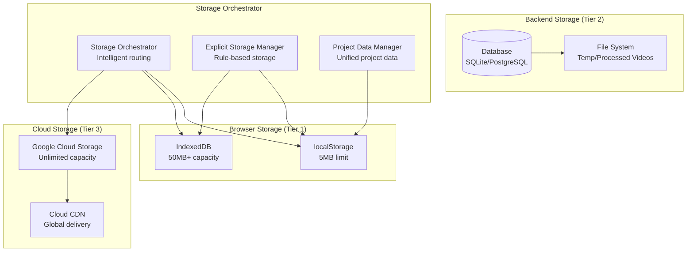

# 💾 Storage Systems - Insomnia Video Editor

**Generated:** December 21, 2024  
**Architecture:** Multi-Tier Storage System  
**Status:** Production Ready with Known Issues  

---

## 📋 **EXECUTIVE SUMMARY**

The Insomnia Video Editor implements a sophisticated multi-tier storage architecture that intelligently routes data between browser storage (localStorage/IndexedDB), backend database, and cloud storage based on data size, access patterns, and performance requirements.

### **Storage Tiers**
1. **Tier 1 - Browser Storage**: localStorage (5MB) + IndexedDB (50MB+)
2. **Tier 2 - Backend Database**: SQLite (dev) / PostgreSQL (prod)
3. **Tier 3 - Cloud Storage**: Google Cloud Storage (unlimited)

### **⚠️ Critical Issues**
- **Multiple Conflicting Systems**: 4+ storage systems don't communicate
- **Data Synchronization**: No unified data management layer
- **Storage Fragmentation**: AI results scattered across different storage tiers

---

## 🏗️ **STORAGE ARCHITECTURE OVERVIEW**



---

## 🔧 **STORAGE ORCHESTRATOR**

### **Core Service (`src/services/storageOrchestrator.ts`)**

**Intelligent Storage Routing:**
```typescript
class StorageOrchestrator {
  private config: StorageConfig = {
    localStorageMaxSize: 5 * 1024 * 1024,    // 5MB
    indexedDBMaxSize: 50 * 1024 * 1024,      // 50MB
    cloudEnabled: isProduction,
    defaultProcessingStrategy: 'auto'
  };

  // Intelligent storage decision
  async saveData(key: string, data: any): Promise<void> {
    const dataSize = this.calculateDataSize(data);
    
    if (dataSize < this.config.localStorageMaxSize) {
      await this.saveToLocalStorage(key, data);
    } else if (dataSize < this.config.indexedDBMaxSize) {
      await this.saveToIndexedDB('general', key, data);
    } else {
      await this.saveToCloudStorage(key, data);
    }
  }
}
```

**Storage Strategy Configuration:**
```typescript
export type StorageStrategy = 'localStorage' | 'indexedDB' | 'cloudStorage' | 'hybrid';

interface StorageConfig {
  localStorageMaxSize: number;
  indexedDBMaxSize: number;
  cloudEnabled: boolean;
  gcsBucket: string;
  cloudRunEndpoint: string;
  defaultProcessingStrategy: ProcessingStrategy;
  clientProcessingTypes: AIAgentType[];
  cloudProcessingTypes: AIAgentType[];
}
```

---

## 📱 **BROWSER STORAGE (TIER 1)**

### **localStorage Implementation**

**Usage Patterns:**
```typescript
// Quick access data (< 5MB)
const STORAGE_KEYS = {
  PROJECT_DATA: 'storyboard-project-v2',
  PROJECT_BACKUP: 'storyboard-project-backup-v2',
  VIEWPORT: 'storyboard-project-viewport',
  TIMELINE_PREFIX: 'timeline-',
  SCENE_PREFIX: 'scene-',
  AI_RESULTS_PREFIX: 'ai-result-'
};

// Project data storage
localStorage.setItem(PROJECT_DATA_KEY, JSON.stringify({
  projectId: string,
  analysisId: string,
  scenes: OptimizedSceneData[],
  viewport: { x: number, y: number, zoom: number },
  metadata: ProjectMetadata
}));
```

**Data Types Stored:**
- **Project Metadata**: Scene titles, tags, user preferences
- **Timeline Edits**: Scene-specific editing data
- **AI Results**: Small AI processing results (subtitles, analysis text)
- **UI State**: Viewport position, panel states, user preferences

### **IndexedDB Implementation**

**Database Schema:**
```typescript
// IndexedDB stores
const INDEXED_DB_STORES = {
  'timeline-edits': { keyPath: 'sceneId' },
  'scene-metadata': { keyPath: 'sceneId' },
  'ai-results': { keyPath: 'id' },
  'video-blobs': { keyPath: 'id' }
};

// Video blob storage
interface VideoBlobData {
  id: string;
  sceneId: string;
  blobType: 'original' | 'processed' | 'aiGenerated';
  blob: Blob;
  timestamp: number;
  size: number;
}
```

**Explicit Storage Manager (`src/services/explicitStorageManager.ts`):**
```typescript
class ExplicitStorageManager {
  private rules: StorageRules;
  
  // Rule-based storage decisions
  async saveTimelineEdits(sceneId: string, edits: TimelineEdits): Promise<void> {
    const storageMethod = this.rules.timelineEdits;
    
    if (storageMethod === 'localStorage') {
      localStorage.setItem(`timeline-${sceneId}`, JSON.stringify(edits));
    } else if (storageMethod === 'indexedDB') {
      await this.saveToIndexedDB('timeline-edits', { sceneId, ...edits });
    }
  }
}
```

---

## 🗄️ **BACKEND DATABASE (TIER 2)**

### **Database Configuration (`backend/database.py`)**

**Multi-Database Support:**
```python
# Environment-based database selection
DATABASE_URL = os.getenv(
    'DATABASE_URL', 
    'sqlite:///./insomnia_transcripts.db'  # Development default
)

# Production PostgreSQL configuration
if DATABASE_URL.startswith('postgresql'):
    engine = create_engine(
        DATABASE_URL,
        pool_pre_ping=True,
        pool_size=10,
        max_overflow=20,
        echo=False
    )
```

### **Data Models**

#### **Video Transcripts Table**
```sql
CREATE TABLE video_transcripts (
    id VARCHAR PRIMARY KEY,
    analysis_id VARCHAR NOT NULL,
    video_filename VARCHAR NOT NULL,
    video_duration FLOAT,
    language_code VARCHAR DEFAULT 'en-US',
    transcription_method VARCHAR DEFAULT 'assemblyai',
    confidence_score FLOAT,
    full_transcript_text TEXT,
    processing_time_seconds INTEGER,
    api_response_id VARCHAR,
    status VARCHAR DEFAULT 'completed',
    created_at TIMESTAMP DEFAULT CURRENT_TIMESTAMP,
    updated_at TIMESTAMP DEFAULT CURRENT_TIMESTAMP
);

CREATE INDEX idx_analysis_id ON video_transcripts(analysis_id);
CREATE INDEX idx_status ON video_transcripts(status);
```

#### **Transcript Segments Table**
```sql
CREATE TABLE transcript_segments (
    id VARCHAR PRIMARY KEY,
    transcript_id VARCHAR REFERENCES video_transcripts(id),
    start_time FLOAT NOT NULL,
    end_time FLOAT NOT NULL,
    text TEXT NOT NULL,
    confidence FLOAT,
    speaker_label VARCHAR,
    segment_type VARCHAR DEFAULT 'word'
);

CREATE INDEX idx_transcript_segments_timing ON transcript_segments(transcript_id, start_time, end_time);
```

#### **Scene Subtitles Cache Table**
```sql
CREATE TABLE scene_subtitles (
    id VARCHAR PRIMARY KEY,
    scene_id VARCHAR NOT NULL,
    transcript_id VARCHAR REFERENCES video_transcripts(id),
    scene_start_time FLOAT NOT NULL,
    scene_end_time FLOAT NOT NULL,
    subtitle_data JSON NOT NULL,
    generated_at TIMESTAMP DEFAULT CURRENT_TIMESTAMP
);

CREATE INDEX idx_scene_subtitles_scene_id ON scene_subtitles(scene_id);
```

### **File System Storage**

**Directory Structure:**
```
backend/
├── temp_video_uploads/          # Temporary upload storage
├── analyzed_videos_store/       # Processed video storage
│   └── {analysis_id}/
│       ├── segments/
│       │   ├── proxy/          # Low-res segments for timeline
│       │   └── mezzanine/      # High-quality segments
│       └── metadata.json
├── analysis_data_store/         # Analysis results
└── exported_videos/            # Final exported videos
```

---

## ☁️ **CLOUD STORAGE (TIER 3)**

### **Google Cloud Storage Integration**

**Cloud Storage Manager (`src/services/cloudStorageManager.ts`):**
```typescript
class CloudStorageManager {
  private config: CloudStorageConfig;
  
  // Signed URL generation for direct uploads
  async getSignedUploadUrl(
    fileName: string,
    contentType: string,
    folder: 'original-uploads' | 'processed-clips' | 'ai-generated'
  ): Promise<{ uploadUrl: string; fileUrl: string }> {
    const response = await fetch(`${this.config.apiEndpoint}/storage/signed-url`, {
      method: 'POST',
      headers: { 'Content-Type': 'application/json' },
      body: JSON.stringify({ fileName, contentType, folder })
    });
    
    return response.json();
  }
}
```

**Bucket Organization:**
```
insomnia_bucket_38/
├── original-uploads/           # User uploaded videos
├── processed-clips/           # AI processed video segments
├── ai-generated/             # AI generated content (audio, effects)
├── exported-videos/          # Final exported projects
└── thumbnails/              # Video thumbnails and previews
```

**Storage Operations:**
- **Direct Upload**: Client-side upload with signed URLs
- **Processing Pipeline**: Automatic processing and storage
- **CDN Integration**: Global content delivery
- **Backup Strategy**: Multi-region replication

---

## 🔄 **DATA SYNCHRONIZATION**

### **⚠️ Critical Issue: Multiple Storage Systems**

**Problem:** The application has 4+ independent storage systems:
```typescript
// 1. React Flow state (in-memory)
const [nodes, setNodes] = useNodesState([]);
const [edges, setEdges] = useEdgesState([]);

// 2. localStorage (browser)
localStorage.setItem('storyboard-project-v2', projectData);

// 3. Timeline data (separate localStorage keys)
localStorage.setItem(`timeline-${sceneId}`, timelineData);

// 4. @designcombo/timeline state (Zustand)
const timelineStore = useStore();

// 5. Project data manager (unified but not used everywhere)
await projectDataManager.saveProject(projectData);
```

### **Storage Integration Layer**

**Attempted Solution (`src/services/storageIntegrationLayer.ts`):**
```typescript
class StorageIntegrationLayer {
  private compatibilityMode = true;
  
  async saveSceneData(sceneData: OptimizedSceneData | EnhancedSceneData): Promise<void> {
    // Enhanced data processing
    const enhancedData = 'videoSources' in sceneData 
      ? sceneData as EnhancedSceneData
      : await this.enhanceSceneData(sceneData);

    // Use storage orchestrator
    await storageOrchestrator.saveEnhancedSceneData(enhancedData);
    
    // Maintain compatibility with existing system
    if (this.compatibilityMode) {
      await this.saveToLegacyFormat(sceneData);
    }
  }
}
```

---

## 📊 **STORAGE CONFIGURATIONS**

### **Predefined Storage Strategies**

**All localStorage Strategy:**
```typescript
const ALL_LOCALSTORAGE_CONFIG = {
  storage: {
    timelineEdits: 'localStorage',
    sceneMetadata: 'localStorage',
    aiResults: {
      'subtitle-generator': 'localStorage',
      'video-enhancer': 'localStorage',
      'audio-processor': 'localStorage'
    },
    videoBlobs: {
      original: 'indexedDB',    // Too large for localStorage
      processed: 'indexedDB',
      aiGenerated: 'indexedDB'
    }
  }
};
```

**Balanced Strategy (Recommended):**
```typescript
const BALANCED_CONFIG = {
  storage: {
    timelineEdits: 'localStorage',      // Fast access
    sceneMetadata: 'localStorage',      // Fast access
    aiResults: {
      'subtitle-generator': 'localStorage',  // Small text data
      'video-enhancer': 'indexedDB',        // Larger results
      'color-grader': 'indexedDB',          // Color data can be large
      'object-detector': 'indexedDB'        // Detection data can be large
    },
    videoBlobs: {
      original: 'cloud',        // Large files to cloud
      processed: 'indexedDB',   // Frequent access
      aiGenerated: 'cloud'      // Large AI-generated content
    }
  }
};
```

**Cloud-First Strategy:**
```typescript
const CLOUD_FIRST_CONFIG = {
  storage: {
    timelineEdits: 'cloud',
    sceneMetadata: 'cloud',
    aiResults: {
      // All AI results to cloud for persistence
      '*': 'cloud'
    },
    videoBlobs: {
      original: 'cloud',
      processed: 'cloud',
      aiGenerated: 'cloud'
    }
  }
};
```

---

## 🔧 **PROJECT DATA MANAGEMENT**

### **Unified Project Data Manager (`src/utils/projectDataManager.ts`)**

**Project Data Structure:**
```typescript
interface OptimizedProjectData {
  projectId: string;
  analysisId: string;
  videoFileName: string;
  videoUrl: string;
  videoDuration: number;
  scenes: OptimizedSceneData[];
  viewport: { x: number; y: number; zoom: number };
  metadata: {
    created: number;
    lastSaved: number;
    lastModified: number;
    version: string;
    saveCount: number;
  };
}
```

**Migration System:**
```typescript
class ProjectDataManager {
  // Migrate from legacy storage format
  async migrateLegacyData(): Promise<OptimizedProjectData | null> {
    const legacyNodes = localStorage.getItem(LEGACY_KEYS.NODES);
    const legacyEdges = localStorage.getItem(LEGACY_KEYS.EDGES);
    const legacyAnalysis = localStorage.getItem(LEGACY_KEYS.ANALYSIS);
    
    if (legacyNodes && legacyAnalysis) {
      const migratedProject = this.convertLegacyToOptimized(
        JSON.parse(legacyNodes),
        JSON.parse(legacyAnalysis)
      );
      
      await this.saveProject(migratedProject);
      return migratedProject;
    }
    
    return null;
  }
}
```

---

## ⚡ **PERFORMANCE OPTIMIZATION**

### **Storage Quota Management**
```typescript
// Check storage quotas
async checkStorageQuotas(): Promise<StorageQuotaInfo> {
  if ('storage' in navigator && 'estimate' in navigator.storage) {
    const estimate = await navigator.storage.estimate();
    return {
      quota: estimate.quota || 0,
      usage: estimate.usage || 0,
      available: (estimate.quota || 0) - (estimate.usage || 0),
      usagePercentage: ((estimate.usage || 0) / (estimate.quota || 1)) * 100
    };
  }
  
  return { quota: 0, usage: 0, available: 0, usagePercentage: 0 };
}
```

### **Cleanup Strategies**
```typescript
// Automatic cleanup of old data
function cleanupOldTimelineData(): CleanupResult {
  const timelineKeys = Object.keys(localStorage)
    .filter(key => key.startsWith('timeline-'))
    .map(key => ({
      key,
      timestamp: getTimestampFromKey(key),
      size: localStorage.getItem(key)?.length || 0
    }))
    .sort((a, b) => a.timestamp - b.timestamp);
  
  // Remove oldest entries if storage is full
  const cleaned = [];
  for (const entry of timelineKeys.slice(0, -10)) { // Keep last 10
    localStorage.removeItem(entry.key);
    cleaned.push(entry.key);
  }
  
  return { cleaned: cleaned.length, errors: [] };
}
```

---

## 🚨 **KNOWN ISSUES & TECHNICAL DEBT**

### **Critical Issues**

1. **Storage System Fragmentation**
   - **Problem**: 4+ independent storage systems
   - **Impact**: Data inconsistency, lost AI results
   - **Location**: Throughout application
   - **Fix Required**: Unified storage service

2. **AI Results Not Persisted**
   - **Problem**: AI processing results lost on page refresh
   - **Impact**: Users lose work, have to reprocess
   - **Location**: `src/App.tsx` AI processing handlers
   - **Fix Required**: Proper result persistence

3. **Timeline Data Conflicts**
   - **Problem**: Node timeline vs main timeline data conflicts
   - **Impact**: Editing changes not synchronized
   - **Location**: Timeline components
   - **Fix Required**: Unified timeline data model

### **Performance Issues**

1. **No Storage Quota Management**
   - **Problem**: No monitoring of browser storage limits
   - **Impact**: Storage failures, data loss
   - **Fix Required**: Quota monitoring and cleanup

2. **Inefficient Data Serialization**
   - **Problem**: Large objects stored as JSON strings
   - **Impact**: Slow save/load operations
   - **Fix Required**: Binary serialization for large data

---

## 🎯 **RECOMMENDED FIXES**

### **Immediate (Critical)**
1. **Implement Unified Storage Service** - Single source of truth
2. **Fix AI Result Persistence** - Ensure results survive page refresh
3. **Add Storage Quota Monitoring** - Prevent storage failures

### **Short-term (Important)**
1. **Consolidate Timeline Data** - Unified timeline data model
2. **Implement Data Validation** - Ensure data integrity
3. **Add Conflict Resolution** - Handle competing data changes

### **Long-term (Enhancement)**
1. **Implement Cloud Synchronization** - Real-time data sync
2. **Add Compression** - Reduce storage footprint
3. **Implement Collaborative Storage** - Multi-user data management

---

## 📚 **RELATED DOCUMENTATION**

- [System Architecture](./01-SYSTEM-ARCHITECTURE.md)
- [Frontend Architecture](./04-FRONTEND-ARCHITECTURE.md)
- [Backend Architecture](./05-BACKEND-ARCHITECTURE.md)
- [Code Quality Assessment](./10-CODE-QUALITY-ASSESSMENT.md)
- [Node Timeline System](./08-NODE-TIMELINE-SYSTEM.md)
