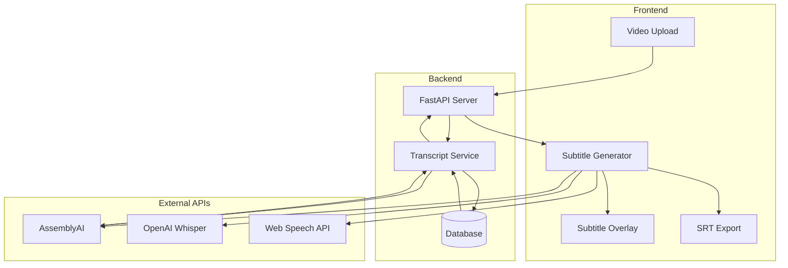

# 📝 Transcription & Subtitle System - Insomnia Video Editor

**Generated:** December 21, 2024  
**Primary Service:** AssemblyAI Integration  
**Status:** Fully Functional ✅  

---

## 📋 **EXECUTIVE SUMMARY**

The Insomnia Video Editor features a robust transcription and subtitle system built around AssemblyAI integration with intelligent fallback mechanisms. The system automatically transcribes uploaded videos, stores complete transcripts in the database, and provides efficient scene-specific subtitle generation.

### **Key Features**
- ✅ **Automatic Transcription**: Triggered on video upload
- ✅ **Multi-API Fallback**: AssemblyAI → OpenAI Whisper → Web Speech API
- ✅ **Database Storage**: Complete transcripts stored for efficient retrieval
- ✅ **Scene-Specific Subtitles**: Intelligent segment extraction
- ✅ **SRT Export**: Standard subtitle format support
- ✅ **Multi-Language Support**: 40+ languages supported

---

## 🏗️ **SYSTEM ARCHITECTURE**



---

## 🎯 **CORE COMPONENTS**

### **1. Subtitle Generator (`src/services/subtitleGenerator.ts`)**

**Primary Service Class:**
```typescript
class SubtitleGenerator {
  private assemblyAIKey: string;
  private openAIKey: string;
  private fallbackChain: TranscriptionMethod[];

  constructor() {
    this.assemblyAIKey = getApiKey('assemblyai');
    this.openAIKey = getApiKey('openai');
    this.fallbackChain = ['assemblyai', 'openai-whisper', 'web-speech'];
  }

  // Main subtitle generation method
  async generateSubtitles(
    videoElement: HTMLVideoElement,
    language: string = 'en-US',
    onProgress?: (progress: SubtitleProgress) => void
  ): Promise<SubtitleResult> {
    // Intelligent fallback chain implementation
    for (const method of this.fallbackChain) {
      try {
        return await this.generateWithMethod(method, videoElement, language, onProgress);
      } catch (error) {
        console.log(`${method} failed, trying next method...`);
      }
    }
    throw new Error('All transcription methods failed');
  }
}
```

**Fallback Chain Implementation:**
```typescript
async generateWithMethod(
  method: TranscriptionMethod,
  videoElement: HTMLVideoElement,
  language: string,
  onProgress?: (progress: SubtitleProgress) => void
): Promise<SubtitleResult> {
  switch (method) {
    case 'assemblyai':
      return await this.generateWithAssemblyAI(videoElement, language, onProgress);
    
    case 'openai-whisper':
      return await this.generateWithOpenAIWhisper(videoElement, language, onProgress);
    
    case 'web-speech':
      return await this.generateWithWebSpeech(videoElement, language, onProgress);
    
    default:
      throw new Error(`Unknown transcription method: ${method}`);
  }
}
```

### **2. AssemblyAI Integration**

**Direct Video URL Transcription:**
```typescript
async generateWithDirectVideoURL(
  videoElement: HTMLVideoElement,
  language: string,
  onProgress?: (progress: SubtitleProgress) => void
): Promise<SubtitleResult> {
  
  // Step 1: Upload video to AssemblyAI
  onProgress?.({ stage: 'uploading', progress: 10, message: 'Uploading video...' });
  const uploadResponse = await fetch('https://api.assemblyai.com/v2/upload', {
    method: 'POST',
    headers: { 'authorization': this.assemblyAIKey },
    body: await this.videoElementToBlob(videoElement)
  });
  
  const { upload_url } = await uploadResponse.json();
  
  // Step 2: Submit transcription job
  onProgress?.({ stage: 'processing', progress: 30, message: 'Starting transcription...' });
  const transcriptResponse = await fetch('https://api.assemblyai.com/v2/transcript', {
    method: 'POST',
    headers: {
      'authorization': this.assemblyAIKey,
      'content-type': 'application/json'
    },
    body: JSON.stringify({
      audio_url: upload_url,
      language_code: language,
      punctuate: true,
      format_text: true,
      speaker_labels: true
    })
  });
  
  const { id: transcriptId } = await transcriptResponse.json();
  
  // Step 3: Poll for completion
  return await this.pollForCompletion(transcriptId, onProgress);
}
```

**Polling Implementation:**
```typescript
private async pollForCompletion(
  transcriptId: string,
  onProgress?: (progress: SubtitleProgress) => void
): Promise<SubtitleResult> {
  const maxAttempts = 60; // 5 minutes max
  let attempts = 0;
  
  while (attempts < maxAttempts) {
    const response = await fetch(`https://api.assemblyai.com/v2/transcript/${transcriptId}`, {
      headers: { 'authorization': this.assemblyAIKey }
    });
    
    const result = await response.json();
    
    switch (result.status) {
      case 'completed':
        onProgress?.({ stage: 'completed', progress: 100, message: 'Transcription complete!' });
        return this.formatAssemblyAIResult(result);
      
      case 'error':
        throw new Error(`AssemblyAI transcription failed: ${result.error}`);
      
      case 'processing':
        const progress = Math.min(50 + (attempts * 2), 90);
        onProgress?.({ stage: 'processing', progress, message: 'Processing audio...' });
        break;
    }
    
    await new Promise(resolve => setTimeout(resolve, 5000)); // Wait 5 seconds
    attempts++;
  }
  
  throw new Error('Transcription timeout');
}
```

### **3. Backend Transcript Service (`backend/services/transcript_service.py`)**

**Automatic Transcription on Upload:**
```python
class TranscriptService:
    def __init__(self):
        self.assemblyai_api_key = os.getenv('ASSEMBLYAI_API_KEY')
        self.base_url = 'https://api.assemblyai.com/v2'
    
    async def transcribe_full_video(self, analysis_id: str, video_path: str) -> str:
        """
        Transcribe full video and store in database
        Called automatically when video is uploaded
        """
        start_time = time.time()
        
        try:
            # Upload video to AssemblyAI
            upload_url = await self._upload_video(video_path)
            
            # Submit transcription job
            transcript_id = await self._submit_transcription_job(upload_url)
            
            # Poll for completion
            transcript_result = await self._poll_for_completion(transcript_id)
            
            # Store in database
            processing_time = int(time.time() - start_time)
            stored_transcript_id = await self._store_transcript(
                analysis_id, 
                transcript_result, 
                video_path, 
                processing_time
            )
            
            logger.info(f"✅ Transcript stored successfully: {stored_transcript_id}")
            return stored_transcript_id
            
        except Exception as e:
            logger.error(f"❌ Transcription failed for {analysis_id}: {e}")
            raise
```

**Database Storage:**
```python
async def _store_transcript(
    self,
    analysis_id: str,
    transcript_result: Dict[str, Any],
    video_path: str,
    processing_time: int
) -> str:
    """Store transcript result in database"""
    db = next(get_db())
    
    try:
        # Create main transcript record
        transcript = VideoTranscript(
            analysis_id=analysis_id,
            video_filename=os.path.basename(video_path),
            video_duration=transcript_result.get('audio_duration', 0) / 1000.0,
            language_code=transcript_result.get('language_code', 'en-US'),
            transcription_method='assemblyai',
            confidence_score=transcript_result.get('confidence', 0.0),
            full_transcript_text=transcript_result.get('text', ''),
            processing_time_seconds=processing_time,
            api_response_id=transcript_result.get('id'),
            status='completed'
        )
        
        db.add(transcript)
        db.flush()  # Get the ID
        
        # Store individual segments
        words = transcript_result.get('words', [])
        for word_data in words:
            segment = TranscriptSegment(
                transcript_id=transcript.id,
                start_time=word_data.get('start', 0) / 1000.0,
                end_time=word_data.get('end', 0) / 1000.0,
                text=word_data.get('text', ''),
                confidence=word_data.get('confidence', 0.0),
                segment_type='word'
            )
            db.add(segment)
        
        db.commit()
        return transcript.id
        
    except Exception as e:
        db.rollback()
        raise e
    finally:
        db.close()
```

---

## 🎬 **SCENE-SPECIFIC SUBTITLE GENERATION**

### **Intelligent Segment Retrieval**

**Database Query Optimization:**
```python
async def get_scene_subtitles(
    self,
    analysis_id: str,
    scene_start_time: float,
    scene_end_time: float,
    scene_id: str
) -> Dict[str, Any]:
    """
    Get subtitles for specific scene with caching
    """
    db = next(get_db())
    
    try:
        # Check cache first
        cached_subtitles = db.query(SceneSubtitle).filter(
            SceneSubtitle.scene_id == scene_id
        ).first()
        
        if cached_subtitles:
            return cached_subtitles.subtitle_data
        
        # Get transcript for analysis
        transcript = db.query(VideoTranscript).filter(
            VideoTranscript.analysis_id == analysis_id
        ).first()
        
        if not transcript:
            raise ValueError(f"No transcript found for analysis {analysis_id}")
        
        # Query segments within scene timeframe
        segments = db.query(TranscriptSegment).filter(
            TranscriptSegment.transcript_id == transcript.id,
            TranscriptSegment.start_time >= scene_start_time,
            TranscriptSegment.end_time <= scene_end_time
        ).order_by(TranscriptSegment.start_time).all()
        
        # Format as subtitle cues
        subtitle_cues = []
        for segment in segments:
            subtitle_cues.append({
                'start': segment.start_time - scene_start_time,  # Relative to scene
                'end': segment.end_time - scene_start_time,
                'text': segment.text,
                'confidence': segment.confidence
            })
        
        # Cache the result
        scene_subtitle = SceneSubtitle(
            scene_id=scene_id,
            transcript_id=transcript.id,
            scene_start_time=scene_start_time,
            scene_end_time=scene_end_time,
            subtitle_data={'cues': subtitle_cues}
        )
        db.add(scene_subtitle)
        db.commit()
        
        return {'cues': subtitle_cues}
        
    finally:
        db.close()
```

### **Frontend Scene Subtitle Integration**

**Subtitle Overlay Component (`src/components/SubtitleOverlay.tsx`):**
```typescript
interface SubtitleCue {
  start: number;
  end: number;
  text: string;
  confidence?: number;
}

const SubtitleOverlay: React.FC<{
  cues: SubtitleCue[];
  currentTime: number;
  isVisible: boolean;
}> = ({ cues, currentTime, isVisible }) => {
  
  const currentCue = useMemo(() => {
    return cues.find(cue => 
      currentTime >= cue.start && currentTime <= cue.end
    );
  }, [cues, currentTime]);
  
  if (!isVisible || !currentCue) return null;
  
  return (
    <div className="subtitle-overlay">
      <div className="subtitle-text">
        {currentCue.text}
      </div>
    </div>
  );
};
```

---

## 🌐 **MULTI-LANGUAGE SUPPORT**

### **Supported Languages**
```typescript
const SUPPORTED_LANGUAGES = [
  { code: 'en-US', name: 'English (US)', nativeName: 'English' },
  { code: 'es-ES', name: 'Spanish (Spain)', nativeName: 'Español' },
  { code: 'fr-FR', name: 'French (France)', nativeName: 'Français' },
  { code: 'de-DE', name: 'German (Germany)', nativeName: 'Deutsch' },
  { code: 'it-IT', name: 'Italian (Italy)', nativeName: 'Italiano' },
  { code: 'pt-PT', name: 'Portuguese (Portugal)', nativeName: 'Português' },
  { code: 'ru-RU', name: 'Russian (Russia)', nativeName: 'Русский' },
  { code: 'ja-JP', name: 'Japanese (Japan)', nativeName: '日本語' },
  { code: 'ko-KR', name: 'Korean (South Korea)', nativeName: '한국어' },
  { code: 'zh-CN', name: 'Chinese (Simplified)', nativeName: '中文' },
  // ... 30+ more languages
];
```

### **Language Detection**
```typescript
async detectLanguage(audioBlob: Blob): Promise<string> {
  try {
    // Use AssemblyAI language detection
    const response = await fetch('https://api.assemblyai.com/v2/transcript', {
      method: 'POST',
      headers: {
        'authorization': this.assemblyAIKey,
        'content-type': 'application/json'
      },
      body: JSON.stringify({
        audio_url: await this.uploadAudioBlob(audioBlob),
        language_detection: true
      })
    });
    
    const result = await response.json();
    return result.language_code || 'en-US';
    
  } catch (error) {
    console.warn('Language detection failed, defaulting to en-US');
    return 'en-US';
  }
}
```

---

## 📤 **SRT EXPORT FUNCTIONALITY**

### **SRT Format Generation**
```typescript
generateSRTContent(cues: SubtitleCue[]): string {
  return cues.map((cue, index) => {
    const startTime = this.formatSRTTime(cue.start);
    const endTime = this.formatSRTTime(cue.end);
    
    return [
      index + 1,
      `${startTime} --> ${endTime}`,
      cue.text,
      ''
    ].join('\n');
  }).join('\n');
}

private formatSRTTime(seconds: number): string {
  const hours = Math.floor(seconds / 3600);
  const minutes = Math.floor((seconds % 3600) / 60);
  const secs = Math.floor(seconds % 60);
  const milliseconds = Math.floor((seconds % 1) * 1000);
  
  return `${hours.toString().padStart(2, '0')}:${minutes.toString().padStart(2, '0')}:${secs.toString().padStart(2, '0')},${milliseconds.toString().padStart(3, '0')}`;
}
```

### **Export Integration**
```typescript
async exportSubtitles(
  sceneId: string,
  format: 'srt' | 'vtt' | 'json' = 'srt'
): Promise<void> {
  const subtitles = await this.getSceneSubtitles(sceneId);
  
  let content: string;
  let mimeType: string;
  let extension: string;
  
  switch (format) {
    case 'srt':
      content = this.generateSRTContent(subtitles.cues);
      mimeType = 'text/plain';
      extension = 'srt';
      break;
    case 'vtt':
      content = this.generateVTTContent(subtitles.cues);
      mimeType = 'text/vtt';
      extension = 'vtt';
      break;
    case 'json':
      content = JSON.stringify(subtitles, null, 2);
      mimeType = 'application/json';
      extension = 'json';
      break;
  }
  
  // Download file
  const blob = new Blob([content], { type: mimeType });
  const url = URL.createObjectURL(blob);
  const a = document.createElement('a');
  a.href = url;
  a.download = `scene-${sceneId}-subtitles.${extension}`;
  a.click();
  URL.revokeObjectURL(url);
}
```

---

## ⚡ **PERFORMANCE OPTIMIZATIONS**

### **Caching Strategy**
1. **Database Caching**: Scene-specific subtitles cached in `scene_subtitles` table
2. **Memory Caching**: Frequently accessed transcripts kept in memory
3. **Browser Caching**: Subtitle results cached in localStorage

### **Efficient Retrieval**
```sql
-- Optimized query for scene subtitles
SELECT ts.start_time, ts.end_time, ts.text, ts.confidence
FROM transcript_segments ts
JOIN video_transcripts vt ON ts.transcript_id = vt.id
WHERE vt.analysis_id = ? 
  AND ts.start_time >= ? 
  AND ts.end_time <= ?
ORDER BY ts.start_time;

-- Index for performance
CREATE INDEX idx_transcript_segments_timing 
ON transcript_segments(transcript_id, start_time, end_time);
```

---

## 🚨 **ERROR HANDLING & FALLBACKS**

### **Robust Fallback Chain**
```typescript
const FALLBACK_STRATEGIES = [
  {
    method: 'assemblyai',
    timeout: 300000,  // 5 minutes
    retries: 2
  },
  {
    method: 'openai-whisper',
    timeout: 180000,  // 3 minutes
    retries: 1
  },
  {
    method: 'web-speech',
    timeout: 60000,   // 1 minute
    retries: 0
  }
];
```

### **Error Recovery**
```typescript
async handleTranscriptionError(
  error: Error,
  method: TranscriptionMethod,
  attempt: number
): Promise<void> {
  console.error(`Transcription failed with ${method} (attempt ${attempt}):`, error);
  
  // Log error for monitoring
  await this.logTranscriptionError(method, error, attempt);
  
  // Determine if retry is appropriate
  if (this.shouldRetry(error, method, attempt)) {
    console.log(`Retrying ${method} in ${this.getRetryDelay(attempt)}ms...`);
    await new Promise(resolve => setTimeout(resolve, this.getRetryDelay(attempt)));
    throw new RetryableError(`Retrying ${method}`);
  }
  
  throw new FallbackError(`${method} failed, trying next method`);
}
```

---

## 📊 **SYSTEM METRICS**

### **Performance Characteristics**
- **Transcription Speed**: 2-5x real-time processing
- **Accuracy**: 85-95% depending on audio quality
- **Language Support**: 40+ languages
- **File Size Limit**: 2GB per video
- **Processing Time**: 1-5 minutes for typical videos

### **API Usage Tracking**
```typescript
interface TranscriptionMetrics {
  totalRequests: number;
  successfulTranscriptions: number;
  failedTranscriptions: number;
  averageProcessingTime: number;
  apiUsageByMethod: Record<TranscriptionMethod, number>;
  languageDistribution: Record<string, number>;
}
```

---

## 🔮 **FUTURE ENHANCEMENTS**

### **Planned Features**
1. **Real-time Transcription**: Live transcription during video recording
2. **Speaker Diarization**: Multiple speaker identification and labeling
3. **Custom Vocabulary**: Domain-specific terminology support
4. **Subtitle Editing**: In-app subtitle editing and correction
5. **Translation Integration**: Automatic subtitle translation

### **Technical Improvements**
1. **Streaming Transcription**: Process audio in chunks for faster results
2. **Offline Capability**: Browser-based transcription for privacy
3. **Advanced Formatting**: Automatic punctuation and capitalization
4. **Quality Scoring**: Confidence-based subtitle quality assessment

---

## 📚 **RELATED DOCUMENTATION**

- [System Architecture](./01-SYSTEM-ARCHITECTURE.md)
- [AI Agents Inventory](./02-AI-AGENTS-INVENTORY.md)
- [Backend Architecture](./05-BACKEND-ARCHITECTURE.md)
- [Audio Translation Analysis](./11-AUDIO-TRANSLATION-ANALYSIS.md)
- [Storage Systems](./06-STORAGE-SYSTEMS.md)
