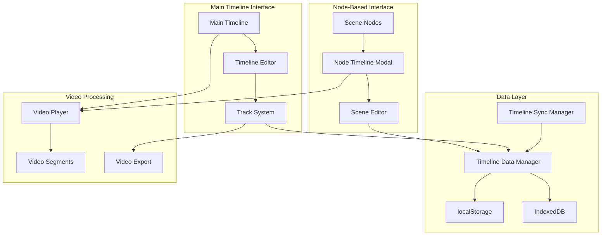

# 🎬 Node Timeline System - Insomnia Video Editor

**Generated:** December 21, 2024  
**Architecture:** Dual Timeline System  
**Status:** Functional with Integration Issues ⚠️  

---

## 📋 **EXECUTIVE SUMMARY**

The Insomnia Video Editor features a sophisticated dual timeline system combining node-based scene management with professional timeline editing. The system includes a scene-specific Node Timeline for detailed editing and a main Timeline Editor for full project composition.

### **Dual Timeline Architecture**
1. **Node Timeline**: Scene-specific editing within modal interface
2. **Main Timeline**: Professional multi-track timeline for full project editing

### **⚠️ Critical Issues**
- **Timeline Synchronization**: Node timeline and main timeline don't communicate
- **Data Persistence**: Timeline edits not properly saved across sessions
- **Integration Conflicts**: Multiple timeline data models cause conflicts

---

## 🏗️ **SYSTEM ARCHITECTURE**



---

## 🎯 **NODE TIMELINE SYSTEM**

### **Core Component (`src/components/NodeTimeline.tsx`)**

**Timeline Modal Interface:**
```typescript
interface NodeTimelineProps {
  scene: (AnalyzedScene & { aiProcessingResults?: NodeVideoSceneData['aiProcessingResults'] }) | null;
  videoUrl: string | null;
  analysisId: string | null;
  isOpen: boolean;
  onClose: () => void;
  onSave?: (edits: SceneEdits) => void;
}

interface NodeTimelineState {
  playhead: number;
  isPlaying: boolean;
  zoomLevel: number;
  selectedClips: string[];
  edits: SceneEdits;
  currentTool: 'selection' | 'blade' | 'hand' | 'zoom';
  clips: Clip[];
  isDragging: boolean;
  dragType: 'move' | 'trim-start' | 'trim-end' | 'playhead' | null;
}
```

**Scene Editing Capabilities:**
```typescript
interface SceneEdits {
  trimStart?: number;
  trimEnd?: number;
  volume?: number;
  brightness?: number;
  contrast?: number;
  saturation?: number;
  textOverlays?: TextOverlay[];
  fadeIn?: number;
  fadeOut?: number;
  clips?: Clip[];
  playhead?: number;
}
```

### **Canvas-Based Timeline Rendering**

**Timeline Canvas Implementation:**
```typescript
const drawTimeline = useCallback((
  canvas: HTMLCanvasElement,
  state: NodeTimelineState,
  scene: AnalyzedScene
) => {
  const ctx = canvas.getContext('2d');
  if (!ctx || !scene) return;

  // Clear canvas
  ctx.clearRect(0, 0, canvas.width, canvas.height);

  // Draw timeline background
  drawTimelineBackground(ctx, canvas.width, canvas.height);

  // Draw video track
  drawVideoTrack(ctx, scene, state.zoomLevel);

  // Draw audio waveform
  if (scene.audio_data) {
    drawAudioWaveform(ctx, scene.audio_data, state.zoomLevel);
  }

  // Draw clips
  state.clips.forEach(clip => {
    drawClip(ctx, clip, state.selectedClips.includes(clip.id));
  });

  // Draw playhead
  drawPlayhead(ctx, state.playhead, canvas.height);

  // Draw text overlays
  state.edits.textOverlays?.forEach(overlay => {
    drawTextOverlay(ctx, overlay, state.playhead);
  });
}, []);
```

**Interactive Timeline Tools:**
```typescript
const TIMELINE_TOOLS = {
  selection: {
    cursor: 'default',
    description: 'Select and move clips'
  },
  blade: {
    cursor: 'crosshair',
    description: 'Split clips at cursor position'
  },
  hand: {
    cursor: 'grab',
    description: 'Pan timeline view'
  },
  zoom: {
    cursor: 'zoom-in',
    description: 'Zoom timeline in/out'
  }
};
```

### **Video Playback Integration**

**Synchronized Playback:**
```typescript
const handlePlayPause = useCallback(() => {
  if (!videoElement || !scene) return;

  if (state.isPlaying) {
    videoElement.pause();
  } else {
    // Calculate video time based on source type
    let videoTime;
    if (scene.proxy_video_url) {
      // Proxy video: direct mapping (starts at 0)
      videoTime = state.playhead;
    } else {
      // Original video: add scene start time
      videoTime = scene.start + state.playhead;
    }
    
    videoElement.currentTime = videoTime;
    
    // Apply audio and video effects
    updateAudioPlayback(state.playhead);
    updateVideoPlayback(state.playhead);
    
    videoElement.play().catch(console.error);
  }

  setState(prev => ({ ...prev, isPlaying: !prev.isPlaying }));
}, [state.isPlaying, state.playhead, scene, videoElement]);
```

**Time Synchronization:**
```typescript
const handleTimeUpdateWithAudio = useCallback(() => {
  if (!videoElement || !scene) return;

  const currentVideoTime = videoElement.currentTime;
  const sceneRelativeTime = currentVideoTime - scene.start;
  
  // Direct mapping: video time to timeline position
  const timelinePosition = Math.max(0, Math.min(sceneRelativeTime, scene.duration));
  
  // Check if we've reached the end
  if (sceneRelativeTime >= scene.duration) {
    videoElement.pause();
    setState(prev => ({ ...prev, isPlaying: false, playhead: scene.duration }));
    return;
  }
  
  setState(prev => ({ ...prev, playhead: timelinePosition }));
}, [scene, videoElement]);
```

---

## 🎵 **MAIN TIMELINE SYSTEM**

### **Professional Timeline Editor (`src/features/editor/timeline/timeline.tsx`)**

**Timeline Framework Integration:**
```typescript
import { timeMsToUnits, unitsToTimeMs } from "@designcombo/timeline";
import CanvasTimeline from "./items/timeline";

// Register timeline components
CanvasTimeline.registerItems({
  Text,      // Text overlays
  Image,     // Image elements  
  Audio,     // Audio tracks
  Video,     // Video tracks
  Caption,   // Subtitle tracks
  Helper,    // Helper elements
  Track,     // Track containers
  PreviewTrackItem  // Drag preview
});
```

**Timeline Store (Zustand):**
```typescript
interface ITimelineStore {
  duration: number;
  fps: number;
  scale: ITimelineScaleState;
  scroll: ITimelineScrollState;
  size: ISize;
  tracks: ITrack[];
  trackItemIds: string[];
  transitionIds: string[];
  transitionsMap: Record<string, ITransition>;
  trackItemsMap: Record<string, ITrackItem>;
  trackItemDetailsMap: Record<string, any>;
  activeIds: string[];
  timeline: Timeline | null;
  playerRef: React.RefObject<PlayerRef> | null;
}
```

### **Multi-Track Architecture**

**Track System:**
```typescript
interface ITrack {
  id: string;
  name: string;
  type: 'video' | 'audio' | 'text' | 'image';
  height: number;
  locked: boolean;
  muted: boolean;
  visible: boolean;
  items: string[]; // Track item IDs
}

interface ITrackItem {
  id: string;
  trackId: string;
  type: 'video' | 'audio' | 'text' | 'image';
  start: number;
  duration: number;
  mediaStart?: number;
  mediaEnd?: number;
  properties: Record<string, any>;
}
```

**Timeline Events System:**
```typescript
// Timeline event handling
useTimelineEvents() {
  useEffect(() => {
    const unsubscribe = subject.subscribe(
      filter(TIMELINE_PREFIX),
      (event) => {
        switch (event.type) {
          case 'TIMELINE_ITEM_ADDED':
            handleItemAdded(event.payload);
            break;
          case 'TIMELINE_ITEM_MOVED':
            handleItemMoved(event.payload);
            break;
          case 'TIMELINE_ITEM_RESIZED':
            handleItemResized(event.payload);
            break;
          case 'TIMELINE_PLAYHEAD_CHANGED':
            handlePlayheadChanged(event.payload);
            break;
        }
      }
    );
    
    return unsubscribe;
  }, []);
}
```

---

## 💾 **TIMELINE DATA MANAGEMENT**

### **Timeline Data Manager (`src/utils/timelineDataManager.ts`)**

**Data Structure:**
```typescript
interface TimelineDataPayload {
  version: string;
  sceneId: string;
  sceneIndex: number;
  originalDuration: number;
  clips: TimelineClip[];
  playhead: number;
  edits: SceneEdits;
  metadata: {
    lastSaved: number;
    lastModified: number;
    saveCount: number;
    checksum: string;
  };
}

interface TimelineClip {
  id: string;
  type: 'video' | 'audio' | 'text';
  startTime: number;
  duration: number;
  mediaStart: number;
  mediaEnd: number;
  trackIndex: number;
  properties: ClipProperties;
}
```

**Robust Save/Load System:**
```typescript
export async function saveTimelineData(
  scene: AnalyzedScene,
  clips: TimelineClip[],
  playhead: number,
  edits: SceneEdits
): Promise<{ success: boolean; error?: string; warnings?: string[] }> {
  try {
    // Check storage quota
    if (needsCleanup()) {
      const cleanupResult = cleanupOldTimelineData();
      console.log(`🧹 Cleaned up ${cleanupResult.cleaned} old entries`);
    }

    // Create timeline data payload
    const timelineData: TimelineDataPayload = {
      version: TIMELINE_DATA_VERSION,
      sceneId: scene.sceneId,
      sceneIndex: scene.scene_index,
      originalDuration: scene.duration,
      clips,
      playhead,
      edits,
      metadata: {
        lastSaved: Date.now(),
        lastModified: Date.now(),
        saveCount: 1,
        checksum: generateChecksum({ clips, playhead, edits })
      }
    };

    // Validate before saving
    const validation = validateTimelineData(timelineData);
    if (!validation.isValid) {
      return {
        success: false,
        error: `Validation failed: ${validation.errors.join(', ')}`
      };
    }

    // Save with backup
    const storageKey = getTimelineStorageKey(scene.sceneId);
    const backupKey = getBackupStorageKey(scene.sceneId);
    
    // Create backup
    const existingData = localStorage.getItem(storageKey);
    if (existingData) {
      localStorage.setItem(backupKey, existingData);
    }

    // Save new data
    localStorage.setItem(storageKey, JSON.stringify(timelineData));
    
    return { success: true };

  } catch (error) {
    return {
      success: false,
      error: `Save failed: ${error.message}`
    };
  }
}
```

### **Timeline Sync Manager (`src/utils/timelineSyncManager.ts`)**

**Cross-Timeline Synchronization:**
```typescript
class TimelineSyncManager {
  private nodeTimelineData: Map<string, TimelineDataPayload> = new Map();
  private mainTimelineData: TimelineState | null = null;
  
  // Sync node timeline changes to main timeline
  async syncNodeToMain(sceneId: string, nodeTimelineData: TimelineDataPayload): Promise<void> {
    try {
      // Store node timeline data
      this.nodeTimelineData.set(sceneId, nodeTimelineData);
      
      // Convert to main timeline format
      const mainTimelineItems = this.convertNodeToMainFormat(nodeTimelineData);
      
      // Update main timeline
      await this.updateMainTimeline(sceneId, mainTimelineItems);
      
      console.log(`✅ Synced node timeline to main for scene ${sceneId}`);
      
    } catch (error) {
      console.error(`❌ Failed to sync node to main timeline:`, error);
      throw error;
    }
  }
  
  // Sync main timeline changes back to node timelines
  async syncMainToNodes(): Promise<void> {
    if (!this.mainTimelineData) return;
    
    for (const [sceneId, nodeData] of this.nodeTimelineData) {
      try {
        const updatedNodeData = this.convertMainToNodeFormat(
          this.mainTimelineData,
          sceneId
        );
        
        await this.updateNodeTimeline(sceneId, updatedNodeData);
        
      } catch (error) {
        console.error(`❌ Failed to sync main to node timeline for ${sceneId}:`, error);
      }
    }
  }
}
```

---

## 🎨 **TIMELINE UI COMPONENTS**

### **Timeline Canvas Rendering**

**Custom Canvas Implementation:**
```typescript
const TimelineCanvas: React.FC<{
  width: number;
  height: number;
  clips: TimelineClip[];
  playhead: number;
  zoomLevel: number;
  onClipSelect: (clipId: string) => void;
}> = ({ width, height, clips, playhead, zoomLevel, onClipSelect }) => {
  
  const canvasRef = useRef<HTMLCanvasElement>(null);
  
  const draw = useCallback(() => {
    const canvas = canvasRef.current;
    const ctx = canvas?.getContext('2d');
    if (!ctx || !canvas) return;
    
    // Clear canvas
    ctx.clearRect(0, 0, width, height);
    
    // Draw timeline grid
    drawTimelineGrid(ctx, width, height, zoomLevel);
    
    // Draw tracks
    const trackHeight = height / 4; // 4 tracks
    for (let i = 0; i < 4; i++) {
      drawTrack(ctx, i, trackHeight, width);
    }
    
    // Draw clips
    clips.forEach(clip => {
      drawTimelineClip(ctx, clip, trackHeight, zoomLevel);
    });
    
    // Draw playhead
    drawTimelinePlayhead(ctx, playhead, height, zoomLevel);
    
  }, [width, height, clips, playhead, zoomLevel]);
  
  useEffect(() => {
    draw();
  }, [draw]);
  
  return (
    <canvas
      ref={canvasRef}
      width={width}
      height={height}
      onMouseDown={handleMouseDown}
      onMouseMove={handleMouseMove}
      onMouseUp={handleMouseUp}
    />
  );
};
```

### **Timeline Controls**

**Playback Controls:**
```typescript
const TimelineControls: React.FC<{
  isPlaying: boolean;
  currentTime: number;
  duration: number;
  onPlayPause: () => void;
  onSeek: (time: number) => void;
  onZoom: (level: number) => void;
}> = ({ isPlaying, currentTime, duration, onPlayPause, onSeek, onZoom }) => {
  
  return (
    <div className="timeline-controls">
      <button onClick={onPlayPause} className="play-pause-btn">
        {isPlaying ? '⏸️' : '▶️'}
      </button>
      
      <div className="time-display">
        {formatTime(currentTime)} / {formatTime(duration)}
      </div>
      
      <input
        type="range"
        min={0}
        max={duration}
        value={currentTime}
        onChange={(e) => onSeek(Number(e.target.value))}
        className="timeline-scrubber"
      />
      
      <div className="zoom-controls">
        <button onClick={() => onZoom(0.5)}>🔍-</button>
        <button onClick={() => onZoom(2)}>🔍+</button>
      </div>
    </div>
  );
};
```

---

## 🔧 **TIMELINE EDITING FEATURES**

### **Clip Manipulation**

**Trimming Operations:**
```typescript
const trimClip = useCallback((
  clipId: string,
  trimType: 'start' | 'end',
  newTime: number
) => {
  setState(prev => ({
    ...prev,
    clips: prev.clips.map(clip => {
      if (clip.id !== clipId) return clip;
      
      if (trimType === 'start') {
        const newDuration = clip.duration - (newTime - clip.startTime);
        return {
          ...clip,
          startTime: newTime,
          duration: Math.max(0.1, newDuration), // Minimum duration
          mediaStart: clip.mediaStart + (newTime - clip.startTime)
        };
      } else {
        return {
          ...clip,
          duration: Math.max(0.1, newTime - clip.startTime)
        };
      }
    })
  }));
}, []);
```

**Clip Splitting:**
```typescript
const splitClipAt = useCallback((clipId: string, splitTime: number) => {
  setState(prev => {
    const clipIndex = prev.clips.findIndex(c => c.id === clipId);
    if (clipIndex === -1) return prev;
    
    const originalClip = prev.clips[clipIndex];
    const relativeTime = splitTime - originalClip.startTime;
    
    // Create two new clips
    const firstClip: TimelineClip = {
      ...originalClip,
      id: `${clipId}-1`,
      duration: relativeTime
    };
    
    const secondClip: TimelineClip = {
      ...originalClip,
      id: `${clipId}-2`,
      startTime: splitTime,
      duration: originalClip.duration - relativeTime,
      mediaStart: originalClip.mediaStart + relativeTime
    };
    
    const newClips = [...prev.clips];
    newClips.splice(clipIndex, 1, firstClip, secondClip);
    
    return { ...prev, clips: newClips };
  });
}, []);
```

### **Audio Processing**

**Real-time Audio Effects:**
```typescript
const updateAudioPlayback = useCallback((currentTime: number) => {
  if (!audioContext || !videoElement) return;
  
  // Apply volume changes
  if (state.edits.volume !== undefined) {
    const gainValue = state.edits.volume / 100;
    gainNode.gain.setValueAtTime(gainValue, audioContext.currentTime);
  }
  
  // Apply fade in/out
  if (state.edits.fadeIn && currentTime < state.edits.fadeIn) {
    const fadeGain = currentTime / state.edits.fadeIn;
    gainNode.gain.setValueAtTime(fadeGain, audioContext.currentTime);
  }
  
  if (state.edits.fadeOut && currentTime > (scene.duration - state.edits.fadeOut)) {
    const fadeGain = (scene.duration - currentTime) / state.edits.fadeOut;
    gainNode.gain.setValueAtTime(fadeGain, audioContext.currentTime);
  }
}, [state.edits, scene, audioContext, gainNode]);
```

---

## 📤 **EXPORT FUNCTIONALITY**

### **Timeline Export to Video**

**Export Pipeline:**
```typescript
const exportTimeline = useCallback(async () => {
  try {
    setExportProgress({ stage: 'preparing', progress: 0 });
    
    // Prepare timeline data for export
    const exportData = {
      sceneId: scene.sceneId,
      clips: state.clips,
      edits: state.edits,
      duration: scene.duration,
      resolution: { width: 1920, height: 1080 },
      fps: 30
    };
    
    setExportProgress({ stage: 'uploading', progress: 20 });
    
    // Send to backend for processing
    const response = await fetch('/api/export/timeline', {
      method: 'POST',
      headers: { 'Content-Type': 'application/json' },
      body: JSON.stringify(exportData)
    });
    
    if (!response.ok) {
      throw new Error(`Export failed: ${response.statusText}`);
    }
    
    setExportProgress({ stage: 'processing', progress: 50 });
    
    // Poll for completion
    const result = await pollExportStatus(response.headers.get('X-Export-Job-Id'));
    
    setExportProgress({ stage: 'completed', progress: 100 });
    
    // Download result
    downloadExportedVideo(result.downloadUrl);
    
  } catch (error) {
    console.error('Export failed:', error);
    setExportProgress({ stage: 'error', progress: 0, error: error.message });
  }
}, [scene, state.clips, state.edits]);
```

---

## 🚨 **KNOWN ISSUES & LIMITATIONS**

### **Critical Issues**

1. **Timeline Synchronization**
   - **Problem**: Node timeline and main timeline don't communicate
   - **Impact**: Edits made in one timeline don't appear in the other
   - **Location**: Timeline sync manager not fully implemented

2. **Data Persistence**
   - **Problem**: Timeline edits not consistently saved
   - **Impact**: Users lose editing work on page refresh
   - **Location**: Multiple storage systems conflict

3. **Performance Issues**
   - **Problem**: Canvas rendering becomes slow with many clips
   - **Impact**: UI lag during complex timeline editing
   - **Location**: Timeline canvas drawing functions

### **Integration Issues**

1. **Storage Conflicts**
   - Node timeline uses localStorage
   - Main timeline uses Zustand store
   - No unified data model

2. **Video Playback Sync**
   - Different video sources (proxy vs original)
   - Timing calculations inconsistent
   - Audio/video sync issues

---

## 🎯 **RECOMMENDED FIXES**

### **Immediate (Critical)**
1. **Implement Unified Timeline Data Model** - Single source of truth
2. **Fix Timeline Synchronization** - Bidirectional sync between timelines
3. **Improve Data Persistence** - Reliable save/load for all timeline data

### **Short-term (Important)**
1. **Optimize Canvas Rendering** - Virtual rendering for large timelines
2. **Standardize Video Playback** - Consistent timing across all video sources
3. **Add Conflict Resolution** - Handle competing timeline changes

### **Long-term (Enhancement)**
1. **Real-time Collaboration** - Multi-user timeline editing
2. **Advanced Effects** - Professional video effects pipeline
3. **Performance Optimization** - WebGL-based timeline rendering

---

## 📚 **RELATED DOCUMENTATION**

- [System Architecture](./01-SYSTEM-ARCHITECTURE.md)
- [Frontend Architecture](./04-FRONTEND-ARCHITECTURE.md)
- [Storage Systems](./06-STORAGE-SYSTEMS.md)
- [Code Quality Assessment](./10-CODE-QUALITY-ASSESSMENT.md)
- [Audio Translation Analysis](./11-AUDIO-TRANSLATION-ANALYSIS.md)
